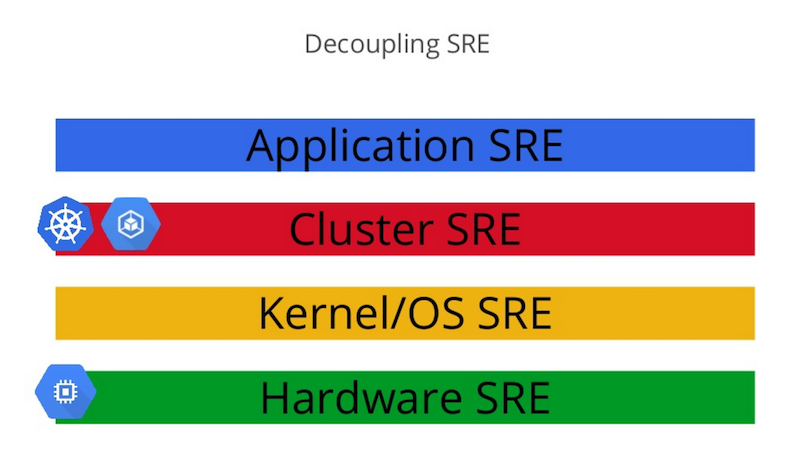

name: inverse
layout: true
class: center, middle, inverse
---

# AppOps for a Greater Good


<br><br>

Dr. Tony Worm

verdverm@gmail.com

IBM Watson - AppOps


.footnote[Project Site: [krobots.io](https://github.com/krobots/krobots-lite)]

---

layout: false
class: left, top

# Agenda

<br>

1. Motivation
1. Overview
1. Deep-dive
1. Demo
1. Hands On with krobots-lite

---


# Motivation

<br>

Docker is great!

> It makes isolation, configuration, consistency, and development
easy.

<br>

But...

> Running lots of containers is hard.


---

# Enter Kubernetes

<br>

> Kubernetes is an open-source system for automating deployment, operations, and scaling of containerized applications.

<br><br>

Released by Google two years ago.

Based on their internal Borg container system.

Cluster-level operation system.


.footnote[[Kubernetes.io](https://kubernetes.io)]

---


# Four Levels in the Stack



---


# DevOps becomes AppOps

<br>

Kubernetes automates common cluster-level tasks.

- Service Discovery
- Deployment management
- Load-balancing & health checks
- Fault-tolerance & High-availability
- Security, secrets, org/user accounts.

It enables developers to manage much fo the
traditional role of DevOps and system admins.

---

# Two Pieces to understand

<br>

Services are _Named Endpoints_

- Named set of Pods
- Service discovery
- Load balancing

Pods are _Single Intention_

- One or more containers
- Horizontally scalable (12 factor)
- Looks and acts as a single unit

Powered by tags, labels, and annotations.

---

# Examples

<br>

- Pods and Deployments
- Services
- Accessing services

---

# Pods and Deployment

Header:

```
apiVersion: extensions/v1beta1
kind: Deployment
metadata:
  name: "..."
```

Spec:

```
spec:
  replicas: #
  template:
    metadata:
      labels: "..."
      annotations: "..."
    spec:
      serviceAccount: "..."
      containers:
      - name: "..."
        image: "..."
        env: "..."
        ports: "..."
        volumeMounts: "..."
        resources: "..."
      volumes: "..."
      securityContext: "..."
```

---

# Pods and Deployment - sample

```
apiVersion: extensions/v1beta1
kind: Deployment
metadata:
  name: "golang-webapp"
spec:
  replicas: 2
  template:
    metadata:
      labels:
        app: golang-webapp
        group: webapp
        tier: frontend
        env: dev
    spec:
      containers:
      - name: golang-webapp
        image: "kubernetes/guestbook:v2"
        ports:
        - containerPort: 3000
```

---

# Services

Header:

```
apiVersion: v1
kind: Service
metadata:
  name: "..."
  labels: "..."
  annotations: "..."
```

Spec:

```
spec:
  type: "..."
  ports: "..."
  selector: "..."
```


---

# Services - sample

```
apiVersion: v1
kind: Service
metadata:
  name: "golang-webapp"
  labels:
    app: golang-webapp
    group: webapp
    tier: frontend
    env: dev
    router.deis.io/routable: "true"
  annotations:
    router.deis.io/domains: guestbook,hyper-k8s,www.krobots.io,krobots.io
spec:
  ports:
    - port: 80
      targetPort: 3000
  selector:
    app: golang-webapp
    group: webapp
    tier: frontend
    env: dev
```

---

# Accessing a service

```
docker-machine ssh $(docker-machine active) -N -L 3000:localhost:3000
```


---


# Demo

1. Docker-machine
1. Clone repository
1. Launch cluster
1. Add DNS
1. Add Redis
1. Add guestbook-go
1. Expose service
1. Show in browser
1. Repeat for todos


---

# krobots-lite


```
krobots hyperkube start

docker-machine ssh $(docker-machine active) -N -L 8080:localhost:8080
kubectl config set-cluster hyper-k8s --server=http://localhost:8080
kubectl config set-context hyper-k8s --cluster=hyper-k8s
kubectl config use-context hyper-k8s

kubectl create namespace
krobots install dns

krobots install redis
cd krobots-lite/examples/guestbook-go
krobots install app
```


